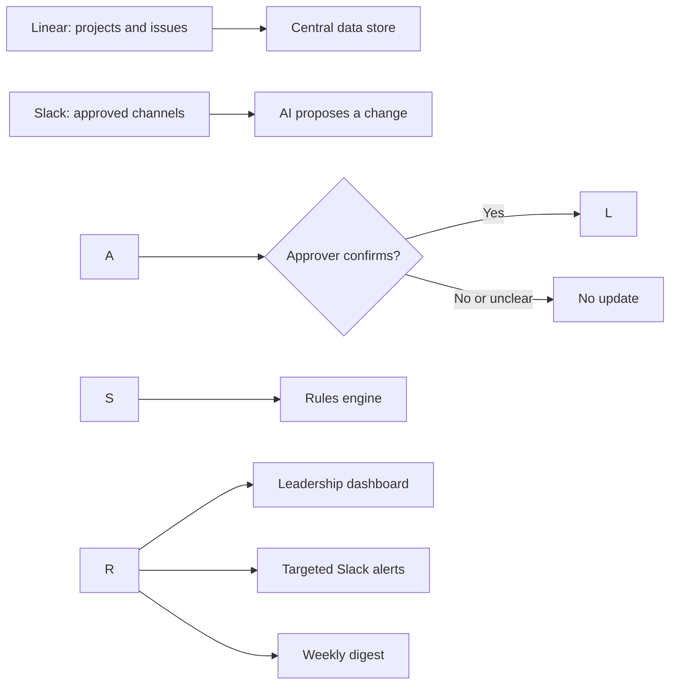

# OpsSignal

An AI-assisted internal operating system for teams that run customer deployments.

Status: scope locked on 2026-10-03. Phase 1 is built first. Phase 2 starts only after Phase 1 runs end to end.

## Phase 1: Internal operating system

### Purpose

In deployment-heavy teams, project information is distributed across Linear, Slack, and Notion. This concept connects those tools so leaders can see what changed, what is at risk, what happens next, and where dependencies require attention.

Every organization arranges Notion differently, so the first step in a real rollout would be to map its content, ownership, and relationship to Linear. This concept uses Notion as the leadership-dashboard layer without assuming it is an authoritative source.

### Architecture

* **Linear:** source of truth for projects, issues, owners, priorities, milestones, dates, health, and dependencies.
* **Slack:** discussion and targeted-alert layer. Only approved project channels are monitored.
* **Notion:** proposed leadership-dashboard layer. Existing content would be connected only after discovery.
* **Data store:** a relational store that retains the current project state, history, risks, and alert status.
* **AI-assisted workflow:** interprets relevant Slack messages and proposes the exact Linear project or issue, field, current value, and proposed value. A project lead or designated approver confirms the proposal before anything changes. If the AI cannot confidently identify the correct record or value, it requests clarification and makes no update.
* **Rules engine:** detects overdue critical work, missing owners, blocked issues, stale project updates, off-track health, and dependency conflicts.
* **Output layer:** updates the leadership dashboard, sends targeted Slack alerts, and produces a weekly leadership digest.

The final database and integration approach would be selected after reviewing an organization's existing infrastructure, security requirements, and tool permissions.



### Operating flow

1. Linear updates are copied into the central relational data store.
2. The workflow compares the latest state with the previous state and records each change in the change history.
3. AI identifies possible changes discussed in approved Slack project channels.
4. The project lead or designated approver confirms or rejects the proposed change.
5. Confirmed Slack-originated updates are written to Linear. Material scope, customer, or technical changes follow the organization's approval process before the official Linear record is updated.
6. The updated Linear record is synchronized back to the central store, which keeps both the latest state and its history.
7. Deterministic rules evaluate the stored data for risks and dependency conflicts.
8. The dashboard refreshes with the latest project state, history, and detected risks.
9. Material risks trigger a targeted Slack alert.
10. A weekly digest summarizes what changed, what is at risk, and what happens next.

### Leadership view

The portfolio dashboard shows one row per deployment:

* Project name and current milestone
* Project status and latest Linear health, as set by the project lead
* Project owner
* Target date
* Latest confirmed change
* Open-risk count
* Highest-priority risk
* AI-suggested next action based only on the verified risk facts, clearly labeled as a suggestion
* Action owner
* Source link

Each project row opens a detail page containing its change history and open risks.

Action owner comes from the owner of the affected issue. If the issue has no owner, the dashboard displays "Unassigned"; AI does not select one. Action due comes from the affected issue's existing due date. If no due date exists, it remains blank.

For a dependency risk, the action owner is the owner of the blocking issue, and the action due date is the due date of the dependent issue.

### Notification rules

A Slack alert is sent when:

* A High or Urgent issue becomes blocked or overdue.
* A High or Urgent issue has no owner.
* A blocking issue is scheduled to finish after dependent work must be completed.
* Project health changes to Off track.
* A required project update becomes stale.
* A confirmed change creates a new cross-team or milestone risk.

Routine updates refresh the dashboard silently.

### Rule definitions

* **High or Urgent:** the issue's priority is High or Urgent.
* **Overdue:** the due date has passed and the issue is not Done.
* **Blocked:** the issue has a blocked-by relationship to an issue that is not Done.
* **Missing owner:** a High or Urgent open issue has no assignee.
* **Delayed dependency:** a blocking issue is due after the dependent issue or milestone.
* **Stale project update:** an active project has no project update for seven days.
* **Off-track health:** the project lead has set the project's health to Off track in Linear.
* **Cross-team or milestone risk:** a confirmed change affects an issue owned by another team, or causes a linked milestone or dependent issue to miss its existing date.

### Project health

OpsSignal does not calculate project health. Linear is the source of truth.

* **Health displayed on the dashboard:** the latest Linear health set by the project lead: On track, At risk, or Off track.
* **Detected risks:** calculated separately by OpsSignal and shown beside the health.
* **Dependency conflict:** produces a risk and an alert but does not change project health.
* **Project lead:** reviews the risk and updates health in Linear if appropriate.
* **Synchronization:** the updated Linear health then flows to the central store and the dashboard.

### Alert lifecycle

Each detected risk receives a stable ID. Its first detection generates one alert. Running the check again without a state change does not create another alert. A new alert is generated only when the risk's severity or impact changes, it reaches an agreed escalation age, or it is resolved.

When one underlying change triggers multiple rules, OpsSignal creates one consolidated alert using the most specific risk type. For example, a delayed dependency that also creates a cross-team risk produces one Dependency risk alert, with the cross-team impact included.

When the project lead changes health to Off track on a project that already has an alerted open risk, no second alert is sent; the health change is added to that risk's history. A change to Off track on a project with no alerted open risk generates its own alert.

In the prototype, escalation by age is described but not built.

### Weekly digest

Deterministic rules select the verified changes, risks, and actions included in the digest. AI may improve the wording but may not add facts. If the AI call fails, the app shows an error instead of a digest.

### Slack alert format

```
Project Atlas: Dependency risk
Changed: Hardware V2 delivery moved from October 10 to October 17.
Impact: Software validation is due October 14 and depends on this delivery.
Required action: Revise the validation schedule or escalate the hardware date.
Action owner: Hardware Lead
Action due: October 14
Source: Linear issue | Slack thread | Project dashboard
```

### Prototype and production approach

In the prototype, the workflow runs when the user selects "Run check." In production, Linear and Slack webhooks would trigger faster updates, while scheduled reconciliation would recover missed events.

AI interprets unstructured information and proposes actions. Deterministic rules and human approval control official updates, risk calculations, and notifications.

### How the prototype builds each part

|Part of the concept|In the prototype|
|-|-|
|Linear as source of truth|A simulated Linear-style project tracker loaded from the seed data|
|Central store with state, history, risks, alert status|SQLite|
|AI interprets messages and proposes a change|Claude API. A valid API key is required for AI-assisted proposals and wording.|
|Approver confirms or rejects; unclear means no update|Built, with an approval trail|
|Confirmed change written to Linear|Written to a simulated Linear-style project tracker, then synchronized to SQLite and recorded in change history. A Linear demo workspace is an optional final integration.|
|Rules engine, all six rules|Built|
|Project lead updates health in Linear|An edit control in the simulated tracker; the change synchronizes to SQLite and the dashboard|
|Leadership dashboard with a detail page|Built into the app in place of Notion|
|Targeted alerts in the format above|In-app alert panel, each alert shown once|
|Weekly digest|Rules pick the facts; AI improves the wording; if the API call fails, the app shows an error|
|Resetting the demo|A "Reset demo" button reloads the seed data as the acknowledged baseline|
|Running the workflow|The user selects "Run check"; webhooks and a schedule are production only|
|Submitting a message|A message input field; the two sample messages below are clickable examples that fill it|

All project data is synthetic and labeled as such on screen.

### Seed data and demo scenario

The JSON seed file encodes one story, and the demo video walks through it. The prototype uses October 1, 2026, as its fixed evaluation date. Changing the computer's date does not change the demo results.

**Project Atlas (the story)**

* Hardware V2 delivery, High priority, due October 10, owned by the Hardware Lead on the Hardware team. It blocks Software validation.
* Software validation, due October 14, owned by the Software Lead on the Software team, linked to the project's next milestone. It depends on Hardware V2 delivery.
* One Urgent issue with no owner. The dashboard shows its action owner as "Unassigned".
* Owners are role titles, not real names. Every issue carries a team, and milestone and dependency links are present so the cross-team rule can run.
* A project update dated earlier than September 24, 2026, so it is stale on the evaluation date. That update set the project's health to On track, and it is the health the dashboard shows.

**Two other projects (for contrast)**

* One project on track, with no open risks.
* One project with a single open risk that does not block a dependency.

**Sample messages**

The message input field offers two clickable examples that fill it:

* A clear message saying Hardware V2 delivery is moving from October 10 to October 17. AI proposes the exact record, field, current value, and new value.
* An unclear message that names no specific issue or date. AI asks for clarification and makes no update.

**Baseline behavior**

Resetting or initializing the demo treats the seed data as the acknowledged baseline. Existing risks are stored and displayed on the dashboard but do not generate new alerts. Only risks created or materially changed after initialization generate alerts.

**What the demo shows**

1. The dashboard opens with Project Atlas showing its latest Linear health beside two detected risks: the unowned Urgent issue and the stale update.
2. Pasting the clear sample message produces a proposal. The approver confirms it.
3. The hardware date changes to October 17 and the change enters the history with the approver's name.
4. "Run check" finds the dependency conflict: the blocker now finishes after Software validation is due.
5. "Run check" creates one Dependency risk alert in the format above. Project Atlas continues to show its latest Linear health until the project lead changes it in the simulated Linear tracker. Selecting "Run check" again creates no second alert.
6. Pasting the unclear sample message produces a clarification request and no update.
7. The project lead changes health to Off track in the simulated tracker. The change is stored there, synchronizes to the central database, and the dashboard refreshes. No duplicate alert is sent; the health change is added to the existing dependency risk history.
8. The digest lists what changed, what is at risk, and what happens next.

### Optional stretch, only if time permits

These are not part of the Phase 1 build and the demo does not depend on them.

* A Slack incoming webhook that also posts each alert to a personal demo workspace
* A Linear demo workspace as the live source of project data
* Reading a live Slack channel instead of manual message entry

### Expected value

* One current leadership view
* Traceable changes and approvals
* Earlier dependency warnings
* Fewer manual status updates
* Targeted alerts instead of notification noise
* A lightweight operating layer that does not replace the tools teams already use

## Phase 2: Field-to-Product loop

Built on the same store and dashboard, after Phase 1 runs.

1. Field Operations records a finding with deployment context, impact, frequency, evidence, equipment, and software version.
2. AI structures the report, identifies potentially related findings, and drafts a summary.
3. Product Operations analyzes frequency, recurrence, operational impact, deployment spread, and supporting evidence.
4. A person classifies the finding as a local operational issue, engineering defect, product requirement, deployment risk, or item to monitor.
5. An approved finding becomes a prioritized requirement with acceptance criteria, owner, dependencies, and target release.
6. Its execution status and deployment impact appear in the dashboard.
7. Field Operations validates the delivered fix against the acceptance criteria.
8. The finding closes only after validation and communication back to the field.

## AI decision boundary

AI may structure reports and messages, identify related items, summarize evidence, draft requirements, alerts and digests from verified facts, and suggest a next action.

AI may not approve a change, finding or requirement, set the official priority, assign accountability, change an official record without confirmation, declare a fix validated, or close a finding.

## Out of scope

* A data-quality or data-operations module
* Logins, multiple organizations, and settings pages
* Real customer, robot, or telemetry data
* Live Notion or Asana connections
* Live Linear and Slack connections, except as the optional stretch above
* Hosting the app online

## Naming rule

No employer or target company is named in the README, screenshots, demo video, or any public post. Linear, Slack, and Notion appear only as the tools the system connects.

## Stack

Python, Streamlit, SQLite, JSON seed data, and the Claude API (key required). Secrets stay in a local .env file that is never committed.

